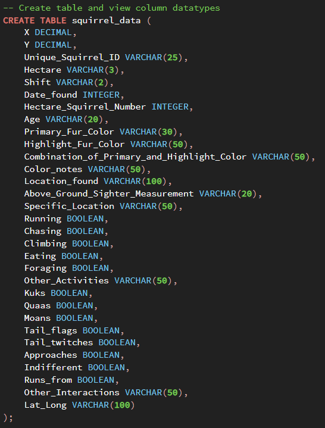

# SQL Squirrel Census

I used this [2018 NYC dataset](https://data.cityofnewyork.us/Environment/2018-Central-Park-Squirrel-Census-Squirrel-Data/vfnx-vebw/about_data) comprised of over 3000 squirrel sightings and data such as age, fur color, activities, interaction with humans, etc.

The information on this dataset was collected by volunteers. More information can be found [here](https://www.thesquirrelcensus.com/).

I am using PostgreSQL and pgAdmin to explore the different patterns NYC squirrels might display. I chose to explore this dataset because it's a fun dataset to explore because the data collection was done through community volunteering. I wondered if that would have an impact on the data quality. 

This is an ongoing project which I'll be updating through my time taking a SQL course. 

## Process

First I modifyed the column names in the dataset to have underscores as the delimiter in order to avoid trouble while querying the data. Next I created a table in pgAdmin with the various datatypes.

Then I copied the csv information to the table. If other users would like to run my queries, the csv will have to be placed in their machine's Public folder. Otherwise, please modify the code shown below in anyway you see fit.

## Data Cleaning

First, I wanted to explore the number of adults vs juvenile squirrels. There were mostly adults found. I also noticed that there are about 110 rows where the volunteer couldn't determine the age. These values had null values or were filled in with "?". I decided to drop the rows that had missing or "?" values for the "age" column since this is important information for analysis. 

## Key Findings

I begain exploring the dataset through queries. Here are my findings:

* The most number of squirrels seen in one day was 400 squirrels recorded on 10/13/18. This could be due to many reasons like the weather, matting patterns, etc.

* Squirrels with gray primary fur colors were the majority observed followed by cinnamon, then black. 

* Most squirrel sightings occured during the PM hours for both adults and juveniles on the ground plane. 
    * They may venture out at night in search of food due to less competition than the daytime. 
    * Volunteers are more likely to spot them closer to the ground.

* More squirrels who approached humans were not found eating. 

## Conclusions

SQL is an excellent tool that could be used to explore and gain more insight on large datasets through queries. Overall, the data was clean and easy to work with because the volunteers and researchers did an excellent job entering data and upkeeping data integrity. 

Further analysis could be used to track the squirrel population for conservation activities. Currently, most squirrel species in North America have the conservation status of "least concern (population stable)" so luckily squirrel conservation analysis may not be necessary for a few more decades.
