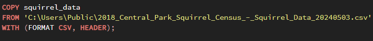
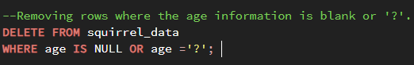

# SQL Squirrel Census

I used this [2018 NYC dataset](https://data.cityofnewyork.us/Environment/2018-Central-Park-Squirrel-Census-Squirrel-Data/vfnx-vebw/about_data) comprised of over 3000 squirrel sightings and data such as age, fur color, activities, interaction with humans, etc.

The information on this dataset was collected by volunteers. More information can be found [here](https://www.thesquirrelcensus.com/).

I'm in the process of using PostgreSQL and pgAdmin to explore the different patterns NYC squirrels might display. I chose to explore this dataset because it's a fun dataset to explore. Further analysis could be used to track the squirrel population for conservation activities.

## Process

First I modifyed the column names in the dataset to have underscores as the delimiter in order to avoid trouble while querying the data. Next I created a table in pgAdmin with the various datatypes.

Then I copied the csv information to the table. If other users would like to run my queries, the csv will have to be placed in their machine's Public folder. Otherwise, please modify the code shown below in anyway you see fit.

## Data Cleaning

First, I wanted to explore the number of adults vs juvenile squirrels. There were mostly adults found. I also noticed that there are about 110 rows where the volunteer couldn't determine the age. These values had null values or were filled in with "?". I decided to drop the rows that had missing or "?" values for the "age" column since this is important information for analysis. 

## Key Findings

I begain exploring the dataset through queries. First, I wanted to find the data where most squirrel sightings occured. 400 squirrels were recorded on 10/13/18. This could be due to many reasons like the weather, matting patterns, etc.

Most squirrel sightings occured during the PM hours for both adults and juveniles on the ground plane.

More squirrels who approached humans were not found eating.
